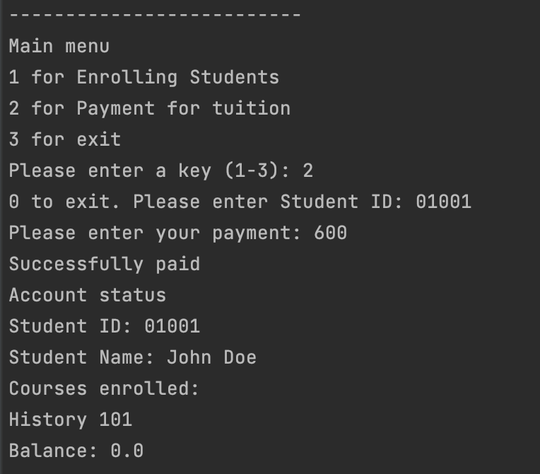

# Java Project: Student Management System

## Abstract

Student Management System is software which is helpful for students as well as the school authorities. In the current system all the activities are done manually. It is very time consuming and costly. Our Student Management System deals with the various activities related to the students.

In the Software we can register as a user and user has of two types, student and administrator. Administrator has the power to add new user and can edit and delete a user. A student can register as user and can add edit and delete his profile. The administrator can add edit and delete marks for the student. All the users can see the marks.

## Scenario:


## Tools Used

- Java SE 17 (LTS)
- Maven
- Intellij IDEA for IDE
- Scanner class
- AtomicLong class for unique counter

## Screenshots

Sample screenshot of the application running in terminal

Enrolling a student


Student paying tuition



## Run Locally

Clone the project

```bash
  git clone https://github.com/donchriscorleone/student-management-system-java.git
```

Go to the project directory

```bash
  cd student-management-system-java
```

Build the project

```bash
  ./mvnw clean package
```

Start the project
```bash
  java -jar target/*.jar
```


## Authors

- [@donchriscorleone](https://www.github.com/donchriscorleone)


## 🔗 Links
[](https://www.linkedin.com/in/christopher-ii-lajom-031959211/)

[](https://www.instagram.com/devchristopherii)

[](https://www.twitter.com/topheriidev)
